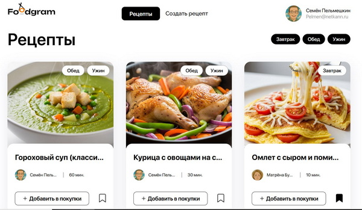
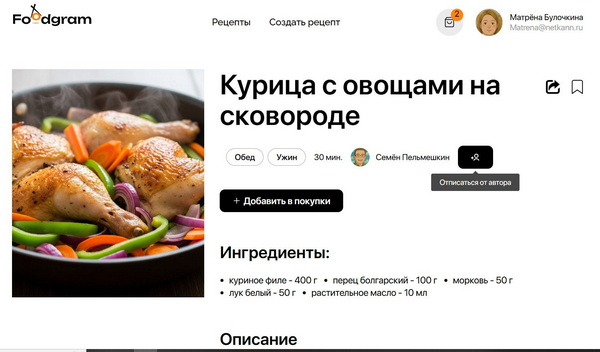
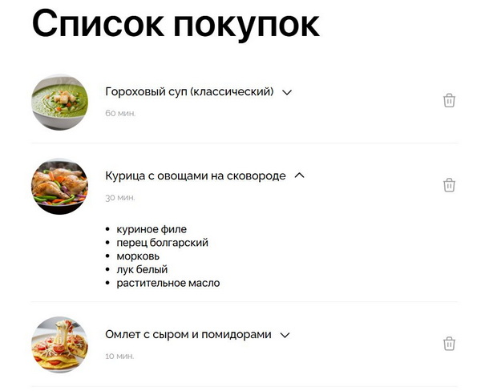

# Foodgram — API и веб-приложение для хранения, публикации и поиска кулинарных рецептов. 

[](https://www.djangoproject.com/)
[](https://reactjs.org/)
[](https://www.postgresql.org/)
[](https://www.docker.com/)

Проект **Foodgram** — это веб-приложение с REST API для управления рецептами, подписками на авторов и списками покупок. Пользователи могут публиковать рецепты, добавлять их в избранное, подписываться на других авторов и формировать список покупок на основе выбранных рецептов.

---

## Функционал

### Для всех пользователей
- Просмотр главной страницы с рецептами
- Просмотр отдельных страниц рецептов
- Просмотр профилей пользователей
- Фильтрация рецептов по тегам
- Постраничная навигация (пагинация)

### Для авторизованных пользователей

#### Работа с рецептами
- Создание собственных рецептов
- Редактирование и удаление своих рецептов
- Добавление рецептов в избранное
- Добавление рецептов в список покупок



#### Подписки
- Подписка на авторов
- Просмотр страницы "Мои подписки"
- Отписка от авторов

#### Список покупок
- Добавление/удаление рецептов в список покупок
- Скачивание списка необходимых ингредиентов в текстовом формате
- Автоматическое суммирование одинаковых ингредиентов в списке



#### Личный кабинет
- Изменение пароля
- Изменение/удаление изображения профиля
- Выход из системы

### Для администраторов
- Управление всеми моделями через админ-панель
- Поиск пользователей по имени и email
- Поиск рецептов по названию и автору
- Фильтрация рецептов по тегам
- Просмотр статистики добавления рецептов в избранное
- Поиск ингредиентов по названию
---

## Установка и запуск проекта

### Установка локально
1. **Клонирование репозитория**  
   Клонируйте репозиторий и перейдите в директорию проекта:
   ```bash
   git clone https://github.com/AVKharkova/foodgram.git
   ```

2. **Переменные окружения**  
   В корневой папке создайте файл `.env` с необходимыми переменными окружения (пример структуры см. в `.env.example`).

3. **Создание виртуального окружения**  
   Создайте и активируйте виртуальное окружение:
   ```bash
   python -m venv venv
   source venv/bin/activate  # Для Windows: venv\Scripts\activate
   ```

4. **Установка зависимостей**  
   Установите зависимости из файла `requirements.txt`:
   ```bash
   python -m pip install --upgrade pip
   pip install -r requirements.txt
   ```

5. **Применение миграций**  
   Настройте базу данных:
   ```bash
   python manage.py migrate
   ```

6. Соберите статику:
    ```bash
    sudo docker compose -f docker-compose.production.yml exec backend python manage.py collectstatic
    sudo docker compose -f docker-compose.production.yml exec backend cp -r /app/collected_static/. /backend_static/static/
    ```

7. Импортируйте ингредиенты и теги:
    ```bash
    sudo docker compose -f docker-compose.production.yml exec backend python manage.py import_ingredients
    sudo docker compose -f docker-compose.production.yml exec backend python manage.py import_tags
    ```

8. Создайте суперпользователя:
    ```bash
    sudo docker compose -f docker-compose.production.yml exec backend python manage.py createsuperuser
    ```
    
9. **Локально запуск сервера**  
   Запустите локальный сервер:
   ```bash
   python manage.py runserver
   ```
   Проект будет доступен по адресу: [http://127.0.0.1:8000/](http://127.0.0.1:8000/).

---

### Управление контейнерами

- Остановить:
    ```bash
    docker-compose -f docker-compose.production.yml down
    ```
- Перезапустить:
    ```bash
    docker-compose -f docker-compose.production.yml restart
    ```
- Логи:
    ```bash
    docker-compose -f docker-compose.production.yml logs -f
    ```
---

## Спецификация API

После запуска проекта документация API доступна по адресу: [http://localhost/api/docs/](http://localhost/api/docs/).  

Основные эндпоинты:
- **Регистрация и аутентификация**: `/api/users/`, `/api/auth/token/login/`.
- **Рецепты**: `/api/recipes/`, `/api/recipes/{id}/favorite/`.
- **Подписки**: `/api/users/subscriptions/`, `/api/users/{id}/subscribe/`.
- **Список покупок**: `/api/recipes/download_shopping_cart/`.

---

## Настройка GitHub Actions

Проект использует GitHub Actions для автоматического деплоя. Workflow находится в .github/workflows/main.yml.

### Необходимые секреты

Settings > Secrets and variables > Actions > Repository secrets

DOCKER_USERNAME — имя пользователя DockerHub

DOCKER_PASSWORD — пароль или токен DockerHub

HOST — IP-адрес сервера (например, 158.160.71.90)

USER — имя пользователя на сервере (например, yc-user)

SSH_KEY — приватный SSH-ключ

SSH_PASSPHRASE — пароль для SSH-ключа

POSTGRES_PASSWORD — пароль для PostgreSQL

SECRET_KEY — секретный ключ Django

TELEGRAM_TO — ID чата Telegram для уведомлений

TELEGRAM_TOKEN — токен Telegram-бота

DB_TYPE - тип базы данных (sqlite или postgres)

---

## Особенности проекта

- **Аутентификация**: Используется токен (Djoser).
- **Роли пользователей**: Анонимные пользователи — просмотр рецептов. Аутентифицированные пользователи — создание рецептов, подписки, избранное. Администраторы — полный доступ к данным.
- **Изображения**: Поддержка загрузки аватаров и изображений для рецептов через Base64 или файловые поля.
- **Список покупок**: Генерация текстового файла для скачивания (с ингредиентами из выбранных рецептов).

---

## Технологический стек

- **Backend**: Python 3.9, Django, Django REST Framework
- **Frontend**: React
- **Контейнеризация**: Docker, Docker Compose
- **База данных**: PostgreSQL
- **Web Server**: Nginx  
- **CI/CD**: GitHub Actions  

---

## Доступ

- **Сайт**: [https://netkann.ru](https://netkann.ru)  
- **Админка**: [https://netkann.ru/admin/](https://netkann.ru/admin/)

---
## Автор
**[Анастасия Харькова](https://github.com/AVKharkova)**
